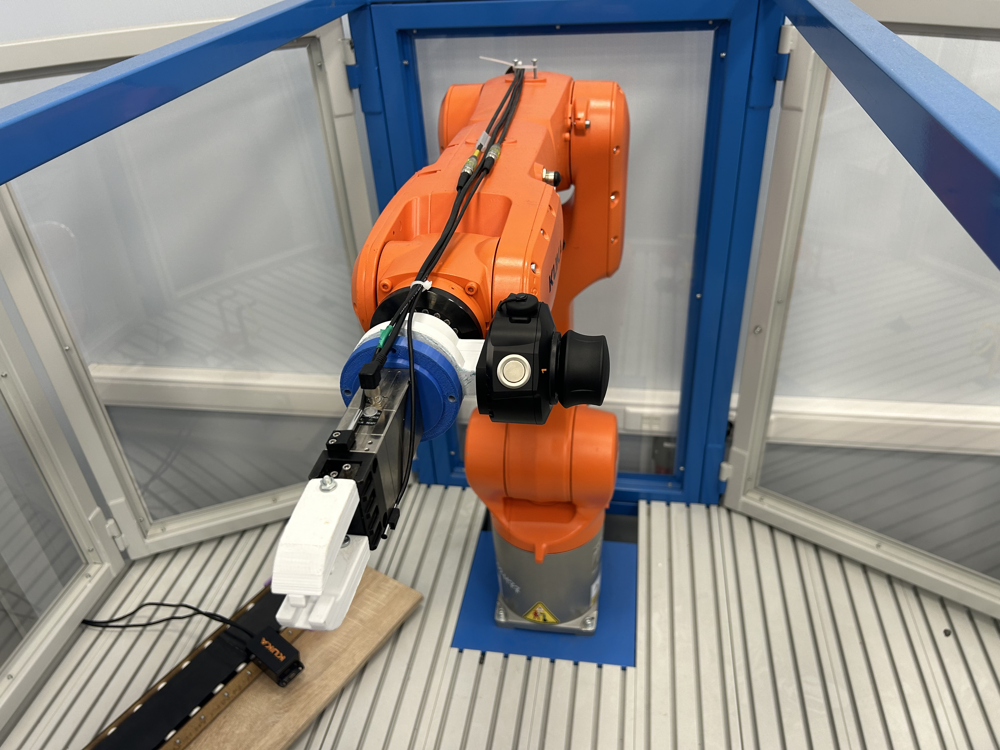
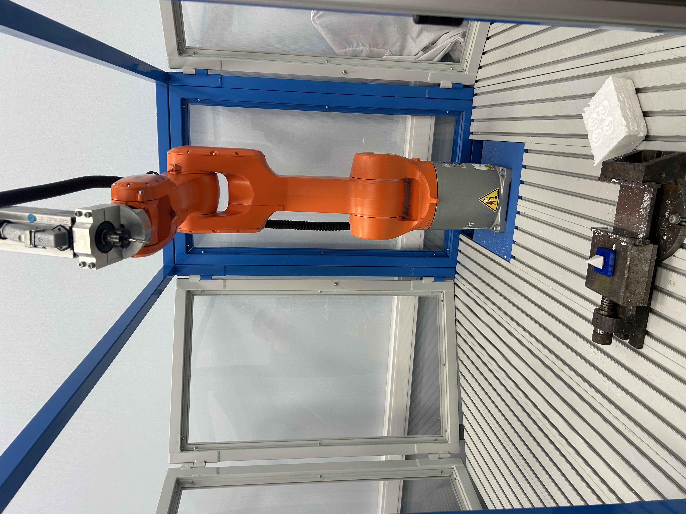

# Примеры программ управления для промышленных роботов KUKA

В данном репозитории находятся примеры программ управления промышленными роботами **KUKA**. 

Примеры программ носят обучающий характер и предназначены для студентов **СПб ГУАП**. Примеры программ применимы ко всем роботизированным ячейкам, применяемым в обучении по дисциплинам *Промышленная робототехника* и *Роботизированная сварка*.

## Используемые робототехнические ячейки

## Что находится в отдельных директориях с примерами

Директории содержат в себе примеры с .src и .dat файлом. Также каждая отдельная директория содержит в себе отдель readme файл с описанием и либо демонстраций полного цикла работы, либо результатом работы отдельных модулей.

