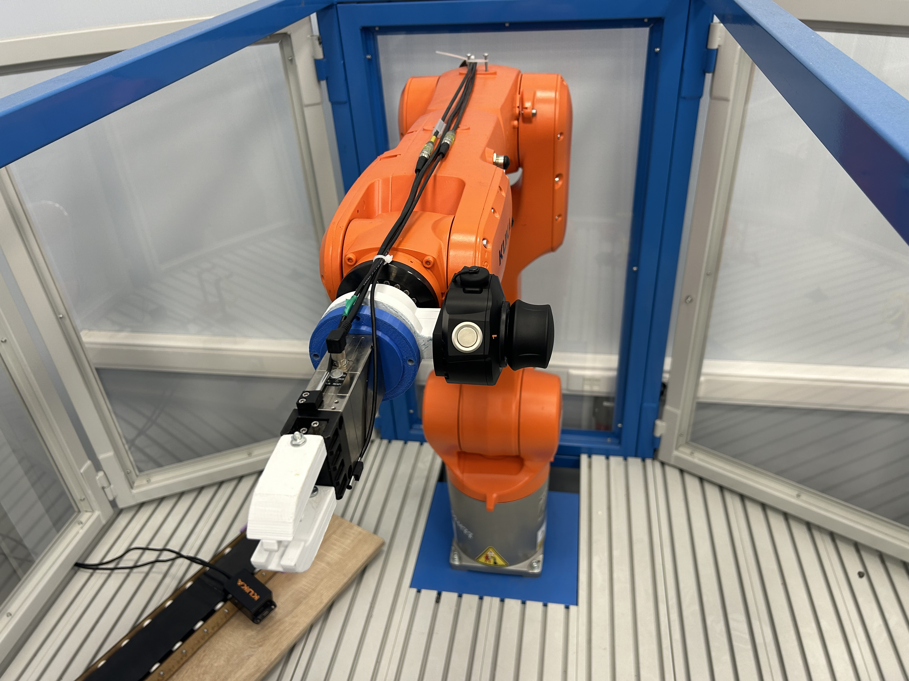
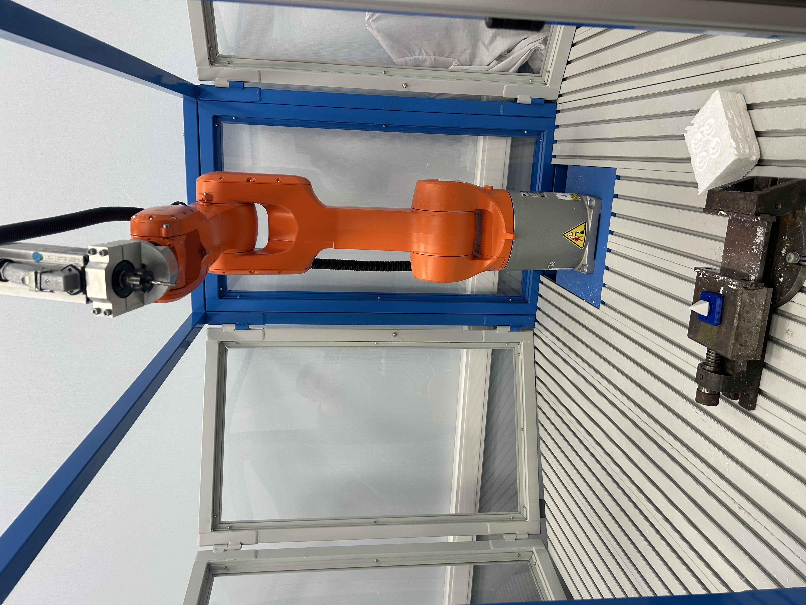

# Примеры программ управления для промышленных роботов KUKA

В данном репозитории находятся примеры программ управления промышленными роботами **KUKA**. 

Примеры программ носят обучающий характер и предназначены для студентов **СПб ГУАП**. Примеры программ применимы ко всем роботизированным ячейкам, применяемым в обучении по дисциплинам *Промышленная робототехника* и *Роботизированная сварка*.

## Используемые робототехнические ячейки
|  |  | |

## Examples

Директория *Examples* содержит в себе примеры с .src и .dat файлом. В *Examples* находятся отдельные директории, где содержатся отдельные readme файлы с описанием или демонстраций полного цикла работы, либо с результатом работы отдельных модулей.

