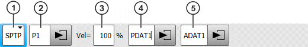

# Простые движения

В данном примере рассмотрены особенности простых движений при работе с промышленными роботами KUKA.

## Cтруктура программы

Модули, создаваемые на роботах KUKA состоят из двух файлов:
1. Файл с расширением *.scr* - это главный исполняемый файл, внутри которого используются готовые выражения, называемые формулярами и отдельные выражения, которые прописывыет.

В примере представлены примеры программы, которые были скопированы с робота через программное обеспечение Work Visual.

Формуляры движений в стандартном виде, которые вы можете увидеть через пульт управления Smart Pad: 

Но в примерах вы можете увидеть полностью закрытую версию формуляра от пользователя часть, которая начинается с **;FOLD** и заканчивается **;ENDFOLD**:
'''
;FOLD SPTP P1 Vel=10 % PDAT1 Tool[1]:Freza Base[0] ;%{PE}
;FOLD Parameters ;%{h}
;Params IlfProvider=kukaroboter.basistech.inlineforms.movement.spline; Kuka.IsGlobalPoint=False; Kuka.PointName=P1; Kuka.BlendingEnabled=False; Kuka.MoveDataPtpName=PDAT1; Kuka.VelocityPtp=10; Kuka.VelocityFieldEnabled=True; Kuka.ColDetectFieldEnabled=True; Kuka.CurrentCDSetIndex=0; Kuka.MovementParameterFieldEnabled=True; IlfCommand=SPTP
;ENDFOLD
SPTP XP1 WITH $VEL_AXIS[1] = SVEL_JOINT(10.0), $TOOL = STOOL2(FP1), $BASE = SBASE(FP1.BASE_NO), $IPO_MODE = SIPO_MODE(FP1.IPO_FRAME), $LOAD = SLOAD(FP1.TOOL_NO), $ACC_AXIS[1] = SACC_JOINT(PPDAT1), $APO = SAPO_PTP(PPDAT1), $GEAR_JERK[1] = SGEAR_JERK(PPDAT1), $COLLMON_TOL_PRO[1] = USE_CM_PRO_VALUES(0)
;ENDFOLD
'''

В данном случае нас интересует только начальная строчка, которая соответствует нашему формуляру:
';FOLD SPTP P1 Vel=10 % PDAT1 Tool[1]:Freza Base[0] ;%{PE}'

2. Файл с расширением *.dat* - это файл, в котором записываются основные значения координат и прочих значений, получаемых из *.src* файла.