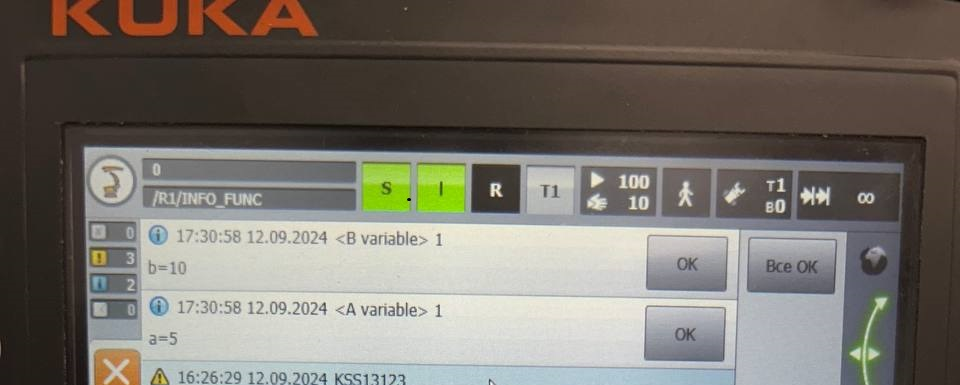

# Вложенные функции

В модулях, создаваемых на промышленных роботах KUKA, помимо основной точки входа исполнения программы, можно добавлять вложенные функции.

Вложенные функции добавляются в программу после ключевого слова **END**, обозначающего границы главного main-функции.

Для обозначения локальной функции как и для основной используется идентификатор **def**, после которого обозначается имя функции, а в круглых скобках указываются параметры функции, если они необходимы. Обозначение конца тела главной функции также обозначается ключевым словом **END**. При переходе на следующую строку кода, на *Smart Pad* главная и побочная части программы будут визуально разделены между собой сплошной линией.

Пример функции без параметров:

```
DEF my_module() ;главная функция
... ;тело главной функции
myFunc() ;вызов вложенной функции
... ;тело главной функции
END ;конец главной функции
____________________________________
def myFunc() ;объявление вложенной функции
...;тело вложенной функции
END ;конец основной функции
```

Параметры вложенной функции могут передаваться в двух режимах:
1. IN - передача параметра только для чтения. При окончанию выполнения манипуляций с передаваемым значением в локальную область и возвратом в главную исполняемую часть значение не будет изменено. Во вложенной функции производится работа с копией аргумента.
2. OUT - передача параметра в режиме записи. При выходе из локальной области вложенной функции и возвратом в основную часть программы значение будет изменено, если над ним производились какие-либо манипуляции. Во вложенную функцию передаётся адресное значение.

Пример функции с параметрами:

```
DEF my_module() ;главная функция
decl int a,b
INI
a = 5
b = 5
myFunc(a,b)

msgNotify("a = %1",,a) ;в окне сообщений будет выведено значение 5
msgNotify("b = %1",,b) ;в окне сообщений будет выведено значение 10

END ;конец главной функции
____________________________________
def myFunc(v1:in, v2:out) ;объявление вложенной функции
decl in v1,v2 ;локальная инициализация переменных
v1 = v1 + 5
v2 = v2 + 5
END ;конец основной функции
```

Вывод значений последнего примера в окне сообщений выглядит следующим образом:



### Примеры

[Ссылка на видео с примером работы модуля **local_funcs**](https://disk.yandex.ru/i/FKRkI3nrGdpMgA)

[Ссылка на видео с примером вывода значений переменных в окне сообщений](https://disk.yandex.ru/i/zFMyZGq4DN6Fow)